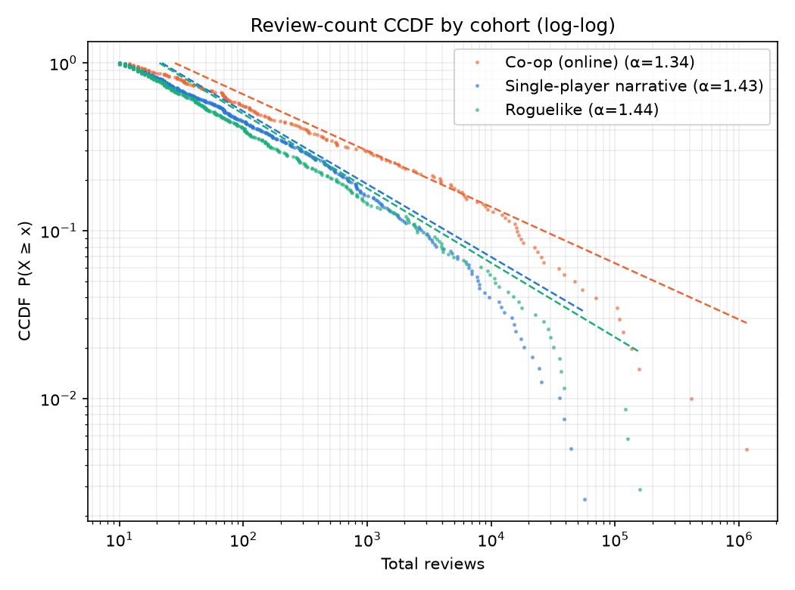
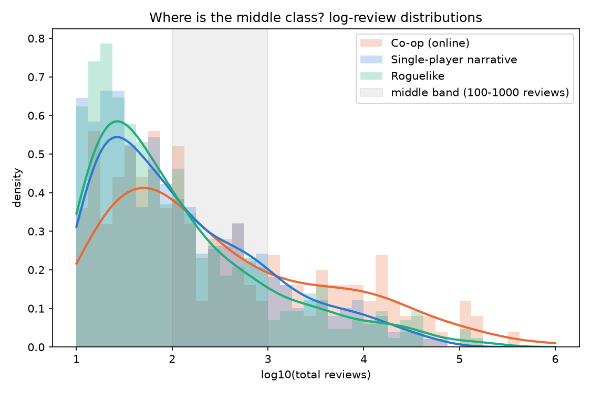
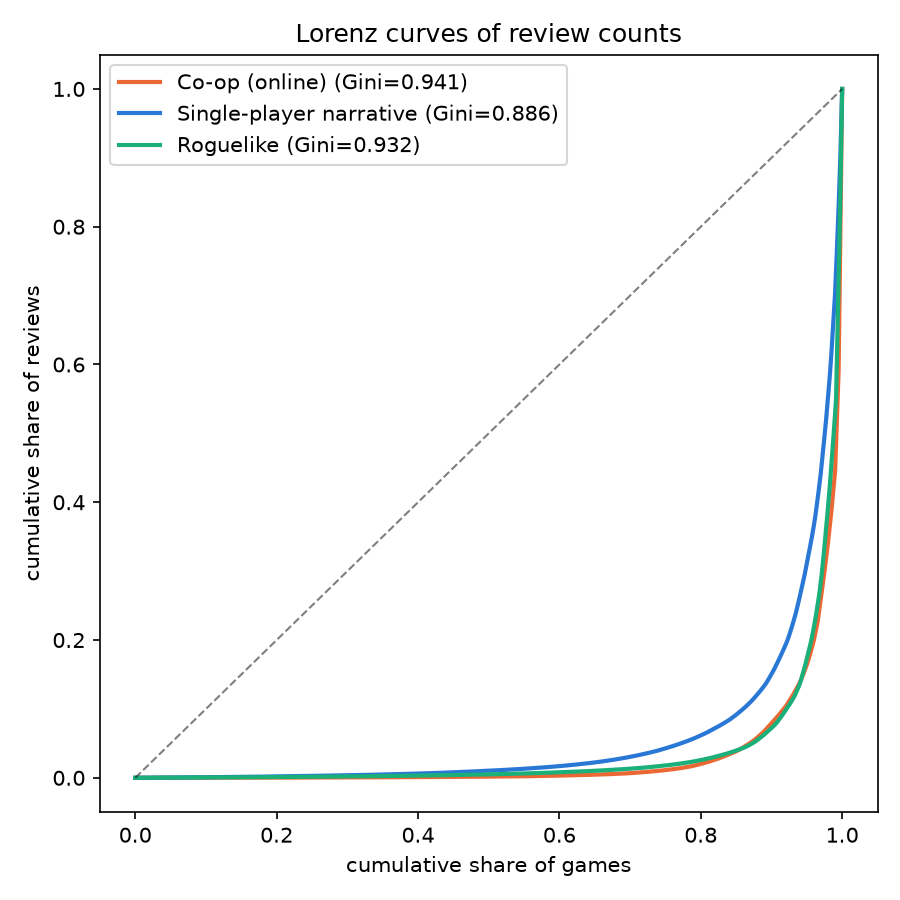

# 코옵 vs 싱글 내러티브 vs 로그라이크: 승자독식 구조 검증 결과

_생성일: 2026-07-21_

**가설:** 온라인 코옵 게임은 친구 그룹 동시 수렴(조정 구조)으로 입소문이 퍼지므로, 싱글 내러티브 게임보다 성공 분포가 더 극단적인 승자독식 형태(supercritical branching process)를 보인다.

**데이터:** 스팀 리뷰 수를 판매량 대리변수로 사용 (Boxleiter 원재료). 코호트 A(코옵) n=201, 코호트 B(싱글 내러티브) n=397, 코호트 R(로그라이크) n=346 (리뷰 ≥10, 유료, <$40, 2022-01~2025-12 출시). 코호트는 상호배타적이며 분류 우선순위는 A(코옵) > R(로그라이크) > B(내러티브).

## 가설 1 — 더 무거운 꼬리 (α_coop < α_single): **기각/불확정**

| 코호트 | n | α | SE | xmin | n_tail | PL vs LN (R, p) |
|---|---|---|---|---|---|---|
| 코옵 | 201 | 1.335 | 0.026 | 28 | 166 | R=-1.80, p=0.071 |
| 싱글 내러티브 | 397 | 1.433 | 0.024 | 22 | 318 | R=-2.55, p=0.011 |
| 로그라이크 | 346 | 1.443 | 0.027 | 21 | 270 | R=-1.35, p=0.177 |

- α 차이 (A − B): **-0.098**, 부트스트랩 95% CI [-0.392, 0.410] (500회 리샘플)
- α 차이 (A − R): -0.108, 95% CI [-0.202, 0.447]
- α 차이 (R − B): 0.010, 95% CI [-0.297, 0.102]
- CI가 0을 제외하고 음수면 코옵 꼬리가 유의하게 더 무겁다는 뜻.
- Clauset 스타일 정직성 체크: R>0이면 power law 우세, R<0이면 lognormal 우세 (p가 크면 판별 불가). 두 코호트 모두에서 lognormal이 기각되지 않으면 '멱함수'라는 딱지보다 '무거운 꼬리' 자체로 해석할 것.



## 가설 2 — 빈 허리 (중간 성공 구간 부재): **기각/불확정**

중간 구간 = 리뷰 100~1,000개 (Boxleiter ×35 ≈ 판매 3.5천~3.5만 장).

| 코호트 | 중간 구간 비율 | dip 통계량 | dip p |
|---|---|---|---|
| 코옵 | 0.264 (53/201) | 0.0204 | 0.864 |
| 싱글 내러티브 | 0.287 (114/397) | 0.0158 | 0.765 |
| 로그라이크 | 0.266 (92/346) | 0.0145 | 0.938 |

- 중간 구간 비율 차이: χ²=0.26, p=0.612; Fisher OR=0.889, p=0.564
- dip test p<0.05면 log10 리뷰 분포가 단봉이 아니라는 증거 (쌍봉성 지지).



## 가설 3 — 더 높은 집중도: **기각/불확정**

| 코호트 | 중간값 | 평균 (중간값의 배수) | 기하평균 | Gini [95% CI] | 상위 1% | 상위 5% | 조기 소멸률(<10리뷰) |
|---|---|---|---|---|---|---|---|
| 코옵 | 129 | 14,029 (×109) | 295 | 0.941 [0.877, 0.960] | 61.0% | 84.9% | 24.2% (64/265) |
| 싱글 내러티브 | 75 | 1,479 (×20) | 126 | 0.886 [0.857, 0.903] | 29.8% | 69.1% | 29.0% (162/559) |
| 로그라이크 | 59 | 2,606 (×44) | 110 | 0.932 [0.896, 0.946] | 49.4% | 83.5% | 32.7% (168/514) |

- 조기 소멸률 차이: χ²=1.87, p=0.171



## 강건성 체크

**코호트 B 대안 정의 민감도:**

| 정의 | n | α | Gini |
|---|---|---|---|
| broad_or_sr_adv_puz | 961 | 1.51 | 0.902 |
| adventure_only | 699 | 1.48 | 0.902 |
| puzzle_only | 364 | 1.61 | 0.911 |
| A_reference | 201 | 1.34 | 0.941 |

## 시대 효과 — 연도별 추세

연도 간 절대값 비교는 리뷰 누적 기간 차이로 오염된다 (2022년작은 ~4년치, 2025년작은 ~1년치). 유효한 독법은 **같은 연도 안에서 코호트끼리 비교** — 누적 기간이 상쇄된다. 배율의 연도별 추세가 장르 우위가 구조적인지 유행 순풍인지를 가른다.

| 연도 | 기하평균 코옵 | 로그라이크 | 내러티브 | 코옵÷내러 | 로그÷내러 |
|---|---|---|---|---|---|
| 2022 | 216 | 188 | 170 | ×1.3 | ×1.1 |
| 2023 | 383 | 110 | 146 | ×2.6 | ×0.8 |
| 2024 | 323 | 94 | 101 | ×3.2 | ×0.9 |
| 2025 | 229 | 80 | 94 | ×2.4 | ×0.9 |

## 한계

- **리뷰-판매 배수의 장르 차이:** Boxleiter 배수(~×30-50)는 장르·가격·연도에 따라 다르다. 코옵 게임은 친구 단위 구매(멀티팩)로 판매당 리뷰 성향이 다를 수 있다. 분포의 *형태* 비교는 배수가 코호트 내에서 리뷰 수와 독립일 때만 완전히 안전하다.
- **스트리밍 노출 교란:** 코옵 히트작은 트위치/유튜브 노출과 상호작용한다. 관측된 집중도가 '친구 조정' 메커니즘만의 결과라고 단정할 수 없다 — 스트리밍은 코옵 장르에 더 강하게 작용하는 증폭기다.
- **SteamSpy 신선도:** 태그·가격은 SteamSpy 캐시 기준이며 일부 게임은 갱신이 느리다. 리뷰 수는 가능한 한 스팀 공식 appreviews로 대체했다 (games.csv의 review_source 참조).
- **생존 편향:** 출시 후 상장폐지(delisted)된 게임은 스팀 공식 API에서 조회 불가라 제외된다. 실패작이 계통적으로 빠지면 두 코호트 모두 조기 소멸률이 과소추정된다.
- **태그는 자기선택:** 태그는 유저/개발자가 붙인다. 경계 사례(코옵 '가능'하지만 본질적으로 싱글 게임 등)의 오분류 가능성.
- **2025 하반기 커버리지:** 컷오프를 2025-12로 두었지만 하반기 출시작은 리뷰 누적 기간이 7~12개월로 짧고 SteamSpy 마스터 목록의 최신작 편입 지연으로 표본 자체가 얇다. 컷오프를 2025-06으로 좁혀도 결과는 사실상 동일했다 (민감도 확인 완료).

## 재현

```
python collect/pipeline.py master && python collect/pipeline.py enrich
python collect/pipeline.py build
python analysis/run_all.py
```